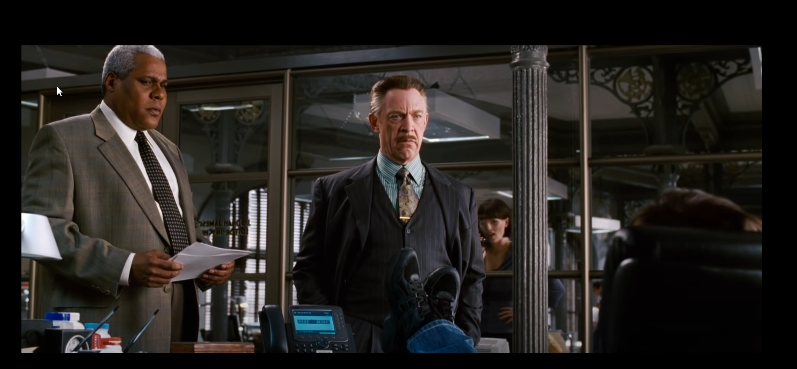
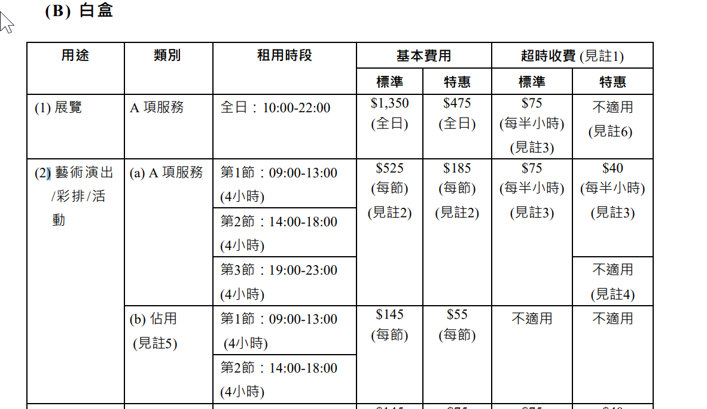
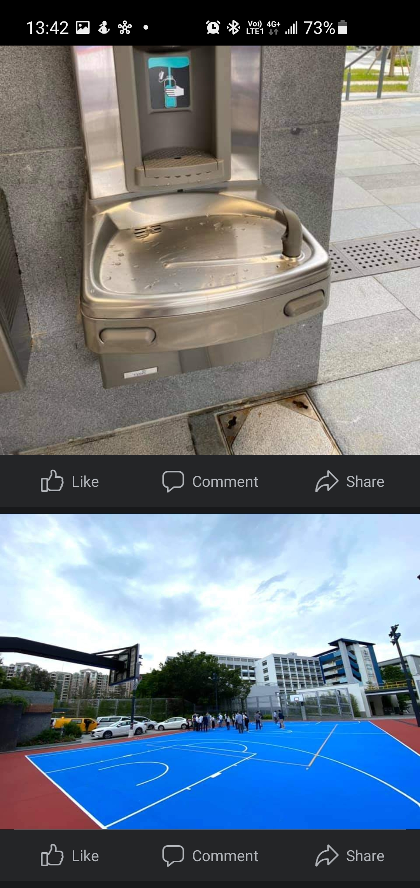
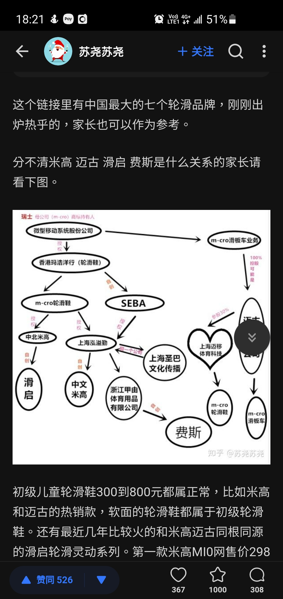
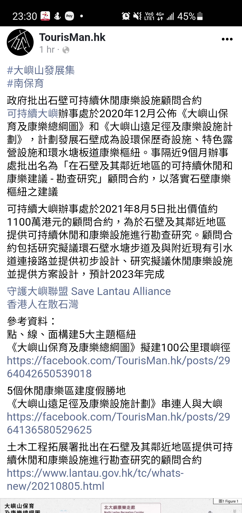
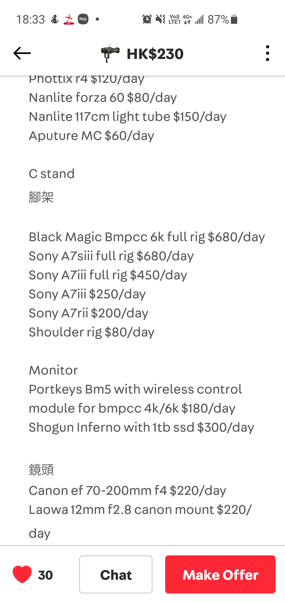

- [[Max Weber]][[Classical Sociology]]在韋伯看來, 革命常常可以讓知識份子感到抗奮。不過，根據一個像消除異化 (disalienation)這樣的含混的概念，就相信人類可以經由革命而有根本的轉變，其實就是以理知的方式，墮入大破之後方能大立 (catastrophism)的意職形態的陷阱。但是，韋伯最不以為然的，是某些馬克思主義知識份子的不寬容；他們深信自己己獲知真理，強要那些他們其實在心底深處鄙視的人，接受這真理。在韋伯看來，他們是「信仰的斗士」(warriors for the faith); 因為他們已認定了一個社會的烏托邦，經驗對他們已沒有影響，所以和他們實在無法進行討論。事實上，韋伯經常提到他與馬克思主義知識份子的面談，特別是那些在德國的俄國流亡人士。對他們，韋伯只有非常有限的信心，因為他感覺他們更熱衷於對權力的追求，而不願對政治活動所咸蓋的各種問題進行反省。
	- 真正說起來，價值中立可說是一種規範研究者行為的原則(regulatory principle) (因此)便有可能被濫用)，而非科學本身的一種構成原則( constitutive principle)。
	- P.97  我們充其量不過是又重新認識到：一件事物之為神聖的，非但不為其不美所礙，並且正是因為其為不美，同時唯在其為不美的條件下，這事物才成其神聖 . . .一件事物，非但其為不善之處無礙於其為美，並且正是在其為不善之處，方見其美。再至於說，一件事物，非但其為不美，不神聖，不善，旨無礙於其為真，並且正是因為其為不美，不神聖，不善，所以才為真；這實在是一項日常的智能。 . . . 因此，人也可以拒絕學術真理。
	- 這世界上仍留存著一個無法消除的非理性基礎，並自其中孕育出信仰與信念等永不縮退的力量。價值與意義一樣，都不內在於事物本身。只有靠我們的信念的強度，靠在通過行動征服或維護這些事物所投注的熱列程度，這些事物才獲得價值與意義。 . . . 因此韋伯，並不指望大同和諧，不管是預定在先 (pre-established)的還是人為的。價值之間 . . .只能以共存、妥協或容忍來處理。
-
-
-
- 
- 南盛街 4px :  星期一至六 10:30 - 19:30,  星期日公假休息。  午飯時間: 14 - 1500
- Multi Mode: Stroboscopic FlashPress Mode Selection Button <(Stroboscopic flash). With stroboscopic flash, a rapid series offlashes is fired. It can be used to capture multiple images of amoving subject in a single photograph. You can set the firingfrequency (number of flashes per sec. expressed as Hz), thenumber of flashes, and the flash output. For setting procedures,see the following
- 每周大清潔行動
  康文署轄下各公眾泳池每周進行一次大清潔行動，時間為上午10時至第二節開放時段完結為止，而泳池會於同日第三節重開。
- [[FlashLight 閃光燈]] [[Lighting 打燈]]
	- Multi Mode: Stroboscopic FlashPress Mode Selection Button <(Stroboscopic flash). With stroboscopic flash, a rapid series offlashes is fired. It can be used to capture multiple images of amoving subject in a single photograph. You can set the firingfrequency (number of flashes per sec. expressed as Hz), thenumber of flashes, and the flash output. For setting procedures,see the following
	- {:height 568, :width 746}
- {:height 8, :width 0}
- 大埔文娛中心
- GRILLTIDER   燒烤盤, 不銹鋼
  https://www.ikea.com.hk/zh/products/cooking-tools/pots-and-cooking-accessories/grilltider-art-10516705
- 練習、講座、會議等A 項服務 第1節：09:00-13:00
  
-
- 大圍巴士線
- [[Gathering]][[Basic Direction to Classical Garden 屋企路線]]
	- {:height 1245, :width 586}
	-
	- [[PoorCinema]][[Meeting Places]] [[Movie Production]] 旺角銀城The Wave: $2000 / 10 hour:  can fit 6 pax
		- JCCAC 1/F
		- 三角琴琴室:  每小時 $30
		- https://www.instagram.com/deven_cheung_dse_chemistry/共享空間 (課室、會議室、自修空間、個人工作空間)
			- 全新裝修、環境舒適、並設有中學教科書及參考書資源、Wifi、Projector、白版、冷熱水等設備
			  太子地鐵站A 出口，1-2分鐘到達
			  歡迎查詢，電話/whatsapp: 93267524 (Deven Cheung)
			- 
-  [[Skating]] [[Skating History 溜冰歷史]]
- Dropbox Engineering Career Framework
	- What’s in a Career Framework?
	  This framework is broken down into two components:
	  Level Expectations define the scope, collaborative reach, and levers for impact at every level; these expectations are the what that determines the difference between an IC3 and IC4, for example
	  Core and Craft Responsibilities define the key behaviors specific to your role and team; these behaviors help you identify how you work to deliver impact based on your level expectations
	- https://dropbox.github.io/dbx-career-framework/overview.html
- [[Lantau Island 大嶼山]][[Tourism]] {:height 411, :width 381}
- [[Movie Production]] 
	-
-
-