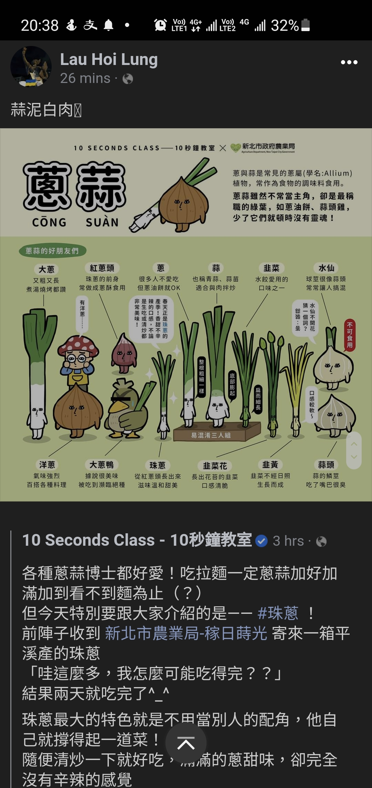
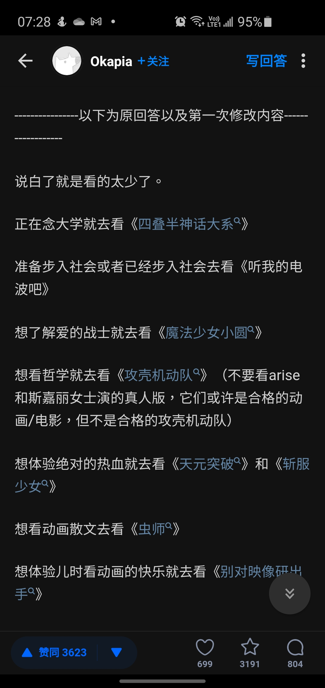
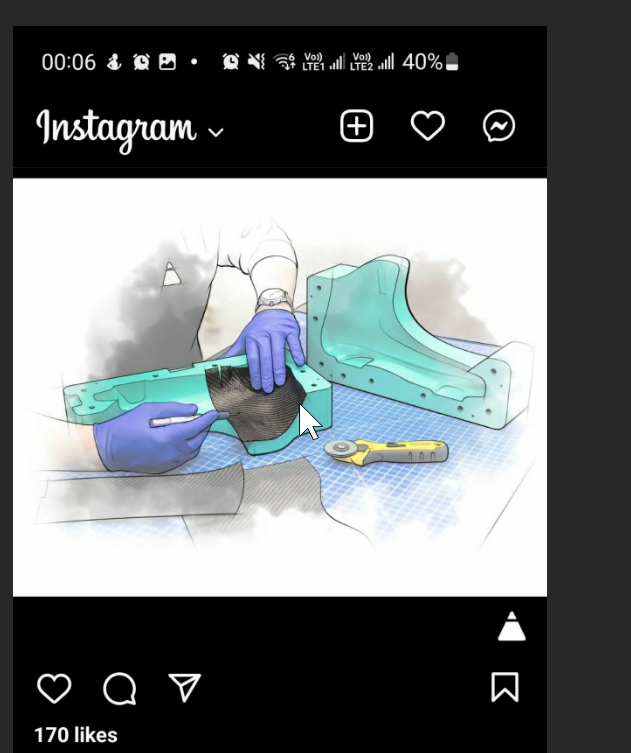

- [[CU Happy Corner 山城角樂]]  回應Tiffany 的悲哀!?  角樂能運作base on 3 assumptions:  1. 持續提供服務給CU Public  2. 有同學各人貢獻幾個鐘來Run 3. 一個工作分配系統去安排每人幹什麼和怎交更。     因為當時發現冇能力做到這事，(自信大學生叻 -> 錯想法)，所以就要 「拎得起放得低」，Withdraw計劃了
- [[Way of Life 生活方法]] 跟本我自己live experience同人就好唔同。不如直按post ig story/fb post. 岩傾既自然會走埋來。 不用直接經whatsapp聊人講野。
- [[English Learning 英文學習]] 以後可以叫Canis Cheung Connie Cheng John Hui 那些人試讀這個 [[Zettelkasten卡片盒筆記]] Writing 方法.  唔知有冇可能. Karis Ching As well
	- 吸引的原因：為 [[非單元化學習]] 架上重要的鷹架。
- [[Zettelkasten卡片盒筆記]] 卡片盒筆記法反而是將一切都有效率地精簡為一件事而已：可以公開發表的獨到見解。 所以要將筆記放在想看見到的位置：而不是每本書都裡面有寫筆記。
	- pp.86-88:  要維持 Cluster Effect -> 才能發揮真正力量，所以不能恣意增加筆記。要避免 優質的筆記會被其他筆記稀釋。
	- 三個常犯錯誤：  什麼都記，不敢有遺漏；二 只因為for 某project ，才去寫筆記。  3rd: [[Permanent Notes]] 卡片筆記要有統一格式、統一擺放位置，才能建立起Cluster Effect
	- 永久筆記與專案筆記清楚地區分開來，讓你在每個專案計劃的範圍內，愛怎樣實驗與修改都可以，而不會干預真正的卡片盒。我建議，用資料夾將每個專案所有手寫的筆記跟印出來的資料單獨整理起來，然後放在同一個地方。   . . .My comment:  專案筆記是內文,  不要起一個page給他們
- [[Grocery 菜]] 78蚊菜： tomato x5 , potato x2 , cucumber x2, yellow Chilli x1 , carrots x1
- 自己好抗拒去外國留學作為Solution,  因為我lack既唔係access to knowledge,  而係skill to organize and create knowledge!
- [[Wish Do List]]目前自己手機的Always on display 不能display tasks. 需要整個widget 去display: 
   For Guidance, check: https://developers.google.com/tasks
- 雞  肉不要洗，避免Spill over gems to other chicken parts
- {:height 274, :width 198}
- [[Travel Route]] 電動滑板人士的郊區路線推介:   https://www.youtube.com/playlist?list=PLuh7uggBROHPjcP3-i7Jej-DqJs2m8aH_   [[Posted to Discord]]
- Diamond Grind a concrete floor: [[skaterink 溜冰場]]
- [[Meal Prep Sunday]] Balkans - Ajkar  -  烤紅椒醬
- [[Anime]]
	- {:height 1583, :width 746}
- [[Skate Storage Shop 溜冰鞋儲存店]] 定量鞋型 - Speed Skate 
-
- [[2nd Hand Store 二手書店]] [[IT for Books]] 憑ISBN 可以在Google Books上找到書本的基本資料。這樣省卻手動抄資料的麻煩。另一個同樣服務是 zbib.org
-