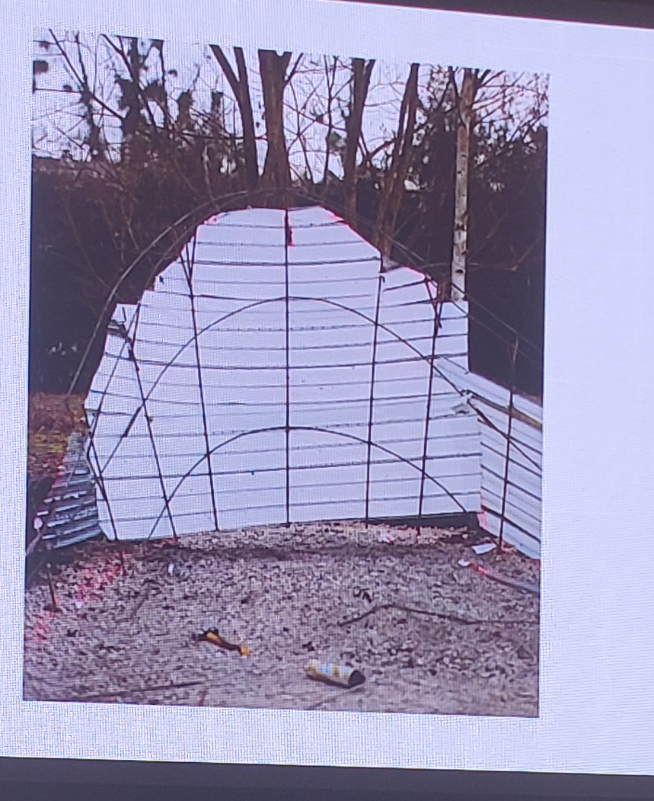
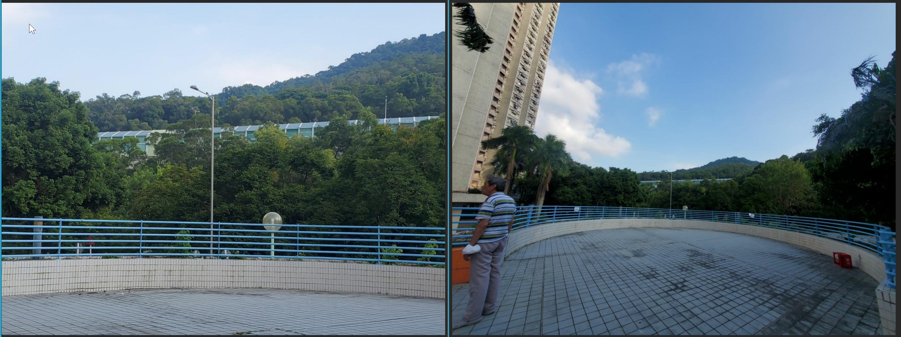
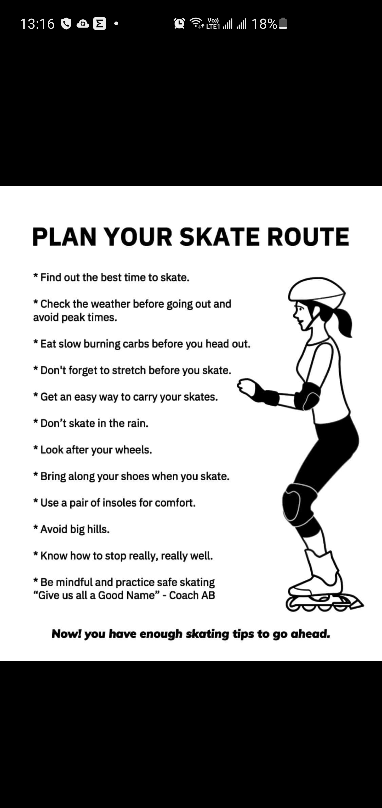
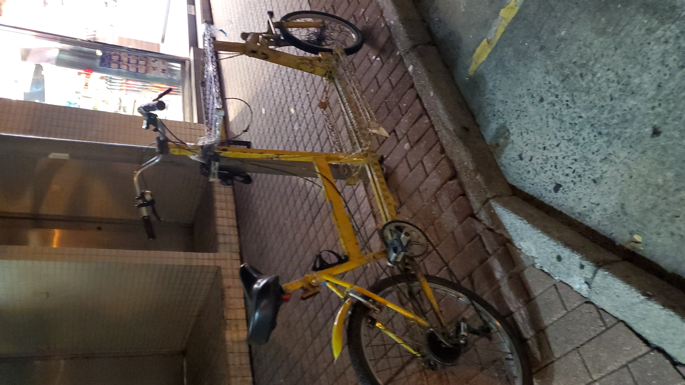
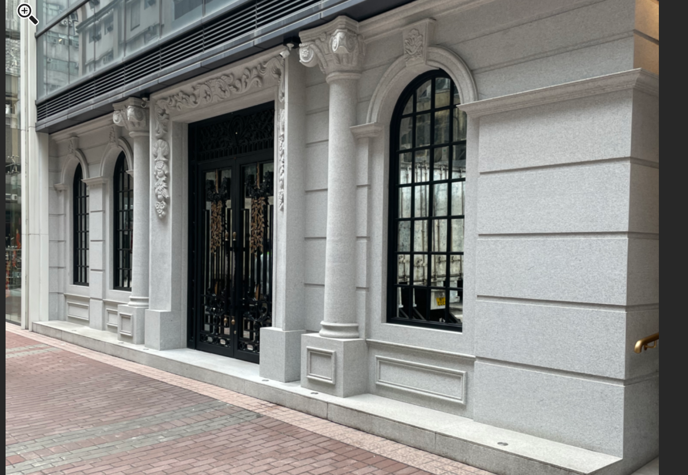
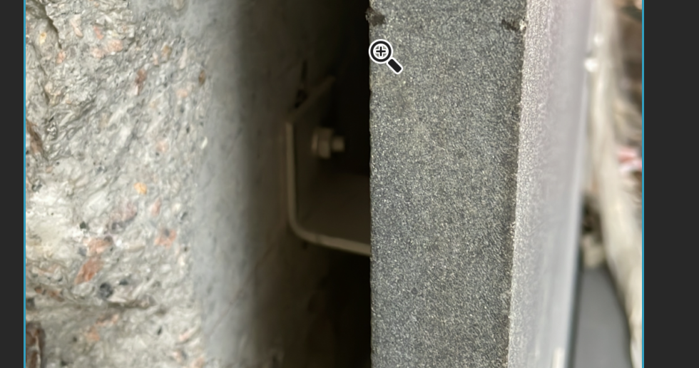
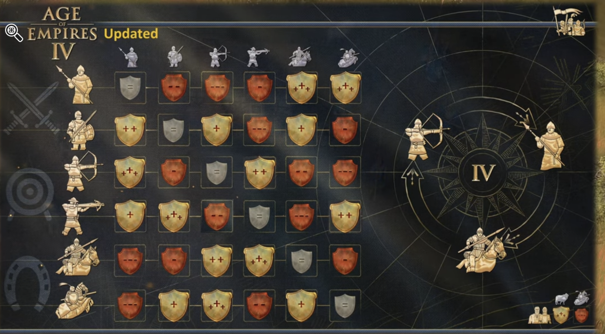

- [[cargo bike]] [[Shimano]] 出咗 e-cargo-specific engine.
- [[Classical Garden]] 18座 吳先生  92537866.  有錢佬... 想快點玩電車...
- [[Skating]] Edgework:  Kidder 2021, skatng.   Helps peopl gain a sense of power and control
	- Creative class:  Richard Florida [[sociology]]
	- 利苑開skatepark
	- Hysan family: 一代煙草大王。  "小太古" 之稱.
	- 
	-
- [[大埔 Tai Po]] [[運頭塘]] [[Live music]]  A good venue for video perfomring, have nice background
	- 
- [[Live Music]] 海麗邨 1/F 圓形草地
- [[rollerblading]]
	- 
	-
- [[大角咀]] [[Metal Work金工]]  溢發五金，在莊啟程附近，通州街28號，專賣焊機 和 馬 牌 (PFERD)德國 介碟
	- [[東淦 Jumbo Orient]] 用的那款
- [[大角咀]]
	- 有人踩Cargo Bike
		- 
- [[大角咀]] 詩歌舞街亮賢居 有 [[Peugeot]]  [[Motorcylce電單車]]  專賣店
	- Oyster Station [[莊啟程 KTC]] 2012 年開張後, 2022年都沒執  (AL畢業那年開的)
- [[阮英偉]] 建議相機加入除氧劑 (鐵粉)的密實袋才放入防潮箱存放
	- 每次使用相機宜牙刷清理外殼 去手汗鹽份
	- 電池不離機，每半年充電
	- 相機跌進水，不要搖相機，拆除Filter 和電池
	- 密實裝著，放雪櫃 或即時拎去維修
	- 要避免鹽份在電路板下乾掉!
	-
- [[大埔 Tai Po]] 74R  可以入去 [[北潭涌]]， 太和 ->  大中 ->  廣福邨 -> . . . ->  黃竹灣 -> 北潭涌.
	- 星期六、日 公眾假期，早上 每60 分鐘一班
	- [[九巴 KMB]]
- [[20S 小巴]][[馬窩]] 大約08分、28分、48分經過運頭角里
- [[將軍澳中心]] [[storage儲物櫃]] 時租 $2 / $5
	- [[東涌 Tung Chung]] Citygate 也有類似服務
- [[油麻地]] 東寶閣 幾好住咁款。 靜中帶旺的感覺
	- $14000,   @41 呎租  實用
	- https://www.house730.com/rent-property-6677968/%E6%B2%B9%E9%BA%BB%E5%9C%B0-%E6%9D%B1%E5%AF%B6%E9%96%A3/?goindex=true
	-
	-
- [[rollerblading]] [[荔枝角]] D2 Place 二期 天台開放,  可以偷偷踩Roller
- 考到 建造業文憑 +  2年工作經驗,  就可以 申請做 "T1訓練課程"
-
-
- [[Metal Work金工]] 全人力公園 裝置 https://www.aipioppi.com/en/entertainment-park/
	- [[昂坪 Ngong Ping]] [[Resort Project]]
- [[長沙環 Cheung Sha Wan]]
	- 金百盛中心 地下 好古典、好型..
	- 
- [[施政報告]] [[TaiPo 大埔]] 2030:  新南北幹道 接通 大埔及西九龍，紓緩 吐公壓力
- [[the CUHK 中文大學]] 私家醫院 收費相對均真:     "Medical Centre"  instead of merely a hospital
- [[Metal Work金工]] [[Welding]]  永保消防工程,  26508368    有CO2 syringe 賣
- [[Metal Work金工]]
	-
- [[K11 Atelier]] [[Skatepark]] 有install 大石板的方法
	- 
-
- [[Mechanical Engineering]]  氣動 vs Server / 液壓。 氣動  Design and manufuacture and use cost are low. Easy for standizaqtion.
	- but it's unsafe for not educated persons
	- and not precise.   (Gas volume correlated with temperature PV=nRT)
	- [[Zhihu 知乎]] 用戶 超級大笨狼 答好多相關問題
- [[電機工程]] 電路佈線裡的programming 叫 PLC
- [[Marriage]] Moissanite 莫son 石  比Diamond 平又好看
- Antec P120 Crystal White 幾靚
- [[Age of Empire 4]] 相生相克 的設計
	- {:height 420, :width 746}
- [[東昌街體育館]] 社區會堂可經以下途經向大埔民政事務處會堂組遞交申請表
	- 可經以下途經向大埔民政事務處會堂組遞交申請表 ( HAD 107(TP)(Aug 2022 ) ) 及相關所需文件 :
	  (l) 傳真至 2665 7680 ;
	  ( 2 ) 電郵至 chcc tp@had.gov.hk ; 或
	  ( 3 ) 投遞至大埔民政諮詢中心 ( 地址 : 新界大埔汀角路 1 號大埔政府合署地下 ) 內的申請表收
	  集箱 。
	  請參閱 < 大埔區社區中心及社區會堂申請須知 ( 修訂版 ) > 及 < 東昌街社區會堂多用途禮堂及
-
-
-
-
-