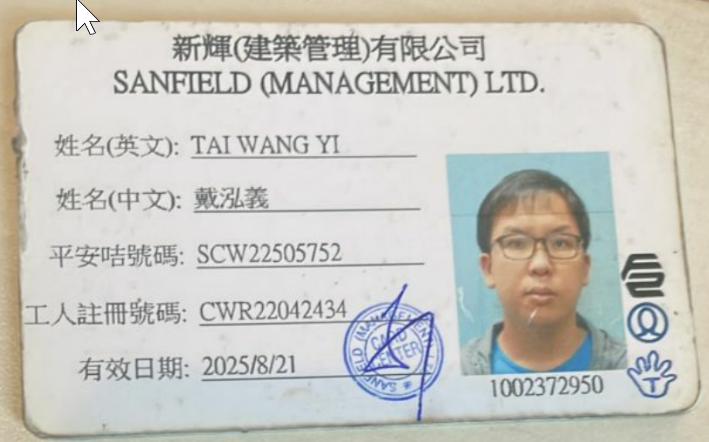
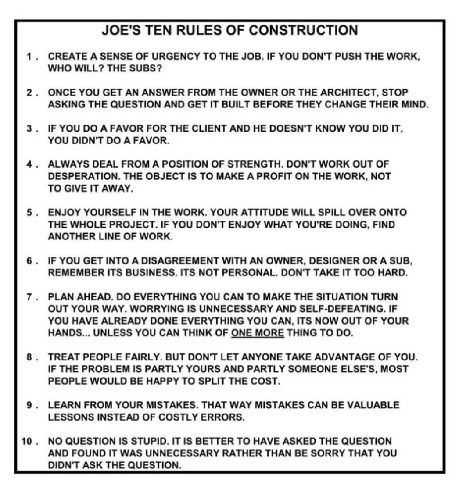

- [[新輝 Sanfield]] 號碼 1002372950. 有效至 2025-08-21
	- 
- 網民Quote: 住 [[康城 Lohas Park]] 基本上衣食住行都冇得揀，好似模擬Game入面啲人礦咁，唯一存在意義就係幫大集團刷數據
- Apply研究所
	- 包裝自己可以快速融入校園文化並有所貢獻的角色
- Joes ten rules of construction  [[Foreman Attitude]]
	- 1 create a sense of urgency to the job. if you don't push the work, who will? the subs?
	- 2 once you get an answer from the owner or the architect. stop asking the question and get it built before they change their mind.
	- 3 if you do a favor for the client and he doesn't know you did it, you didn't do a favor.
	- 4 always deal from a position of strength. don't work out of desperation. the object is to make a profit on the work. not to give it away.
	- 5 enjoy yourself in the work. your attitude will spill over onto the whole project. if you don't enjoy what you're doing, find another line of work.
	- 6 if you get into a disagreement with an owner. designer or a sub, remember its business. its not personal. don't take it too hard.
	- 7 plan ahead. do everything you can to make the situation turn out your way. worrying is unnecessary and self-defeating. if you have already done everything you can, its now out of your hands... unless you can think of one more thing to do.
	- 8 treat people fairly. but don't let anyone take advantage of you. if the problem is partly yours and partly someone else's, most people would be happy to split the cost.
	- 9 learn from your mistakes. that way mistakes can be valuable lessons instead of costly errors.
	- 10 no question is stupid. it is better to have asked the question and found it was unnecessary rather than be sorry that you didn't ask the question.
	- {:height 223, :width 204}
- [[深水埗]] 海壃街 偉光電化廠 23618060 可做electroplatingx
- 戴琦魁
- 香港真Mech: EMSD, DSD, AA, CX, Logistics Cargo (Hactl, Fedex DHL), MTR, CLP, Philips
-