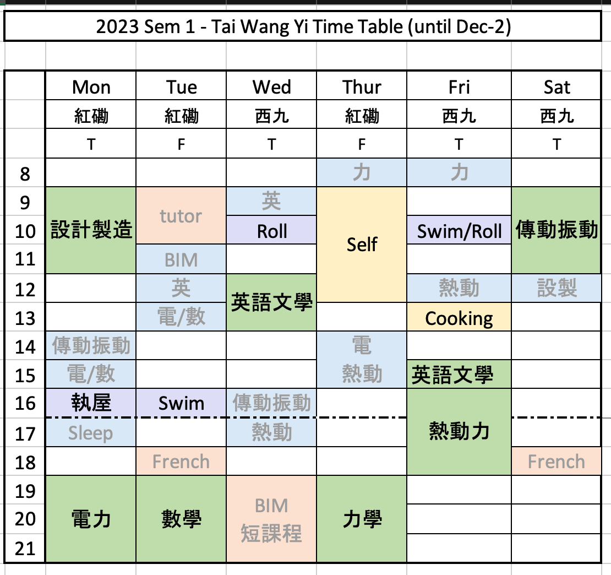

- {{embed ((64f1bf0f-8aee-47a5-9029-9b1fdcc7375e))}}
- student-id::  23044853S@common.cpce-polyu.edu.hk
  PW:: wekvM!wrWnnJ5V2
- My Speed: https://www.speed-polyu.edu.hk/myspeed
- course materials: https://lms.cpce-polyu.edu.hk/ultra/institution-page
- Personal Onedrive folder:  https://1drv.ms/f/s!Av_m3HBOT7vNmMV7VL99soBcMQhegw?e=E82tLQ
- [[Hung Hom Campus]] and [[West Kowloon Campus]]
- [[84062 whole course structure]]
-
- [[Consultation Hours]]
-
- target: each course 3 hours lesson, 4 hour revision  ->   49 workhour per week
- {:height 451, :width 413}
-
- [[Row Echelon Form]] R.E.F. Form: 斜角是 1.   斜角的右上方 是wildcard (*).    左下方一定要是零
	- [[Reduced Row Echelon Form]]  alias: RREF form 斜角右上方，左下方都是零。
-
-