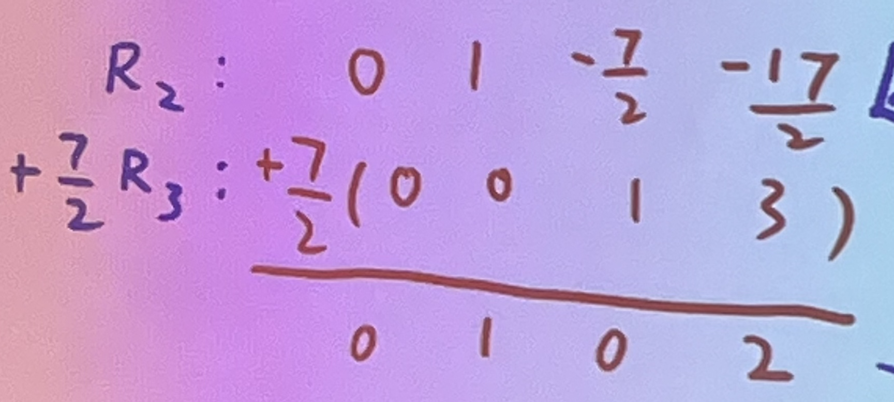

familiarity-out-of-7::  1
time-to-need-PC:: N/A
alias:: SEHS2339
course-outline:: https://1drv.ms/b/s!Av_m3HBOT7vNmax5hQo-9k6amqpl6A?e=ZZC09y
- time-venue:: Tuesday: 19 - 22,  HHB - UG09
  Lecturer: Anthony lam   https://wa.me/85267212983
- Week 9 另外揀日子做mid-term
- Week: 3, 6, 8, 11 In class exercise,    score:    20%
-
- 排第一的variable => leading , 用來solve.      所有其他=> set as free variable  (s, t  . . . u)
- Linear System:  Solution 只有三款.   No solution. Unique Solution. Infinite Solution.
-
- 做row operation 麻煩strictly 使用elementary row operation.  :  target 那邊不要動。  乘好哂 個source, 先 加落個target
-
- 運算式排row 方法 1st => 2nd => 3rd row:    original target,    multiplied source,  resultant target.
- {:height 203, :width 429}
-
-